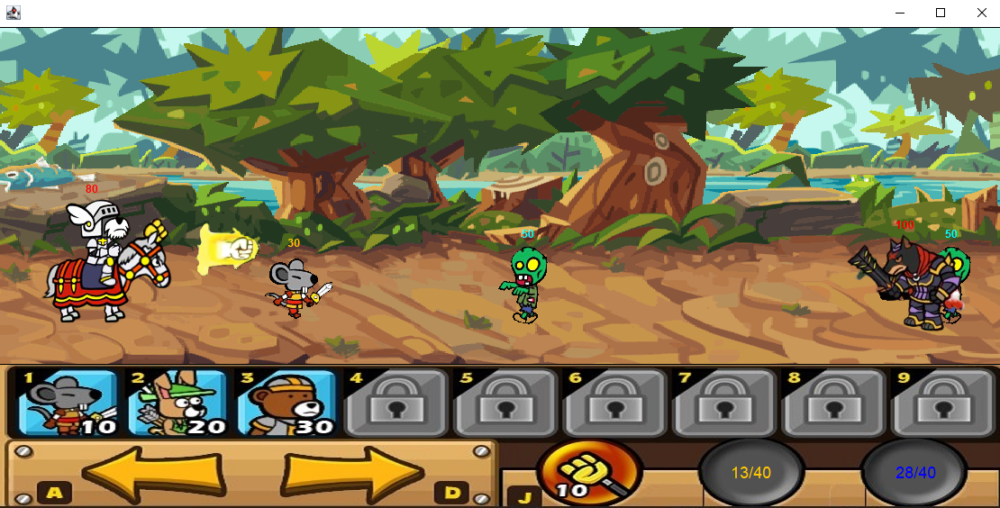

# PalaDogProJect

</img> 

# 프로젝트설명

### 다양한 용병등을 소환하여 전쟁하는 게임입니다.
### 멋진팔라독과 함께 용병을 소환하여 적들을 제거하세요.
### 화면에보이는 주황색 수치가 올라가면 용병을 숫자키로 소환할수 있습니다.

#### 먼저 게임을 실행하면 팔라독과 다크독 오브젝트가 new 되고  동시에 패널에추가해주고 좀비를 소환하는 스레드를 start합니다. 

## <좀비소환>
<pre>
  <code>
  

  </code>
</pre>
###### 1번을 누르면 패널에 주황색수치를 까지게하면서 mouse 오브젝트를 new해주고 동시에 패널에추가합니다 . 그이후 mouse 오브젝트를 컬렉션에 추가하면서 병력을 소환합니다

